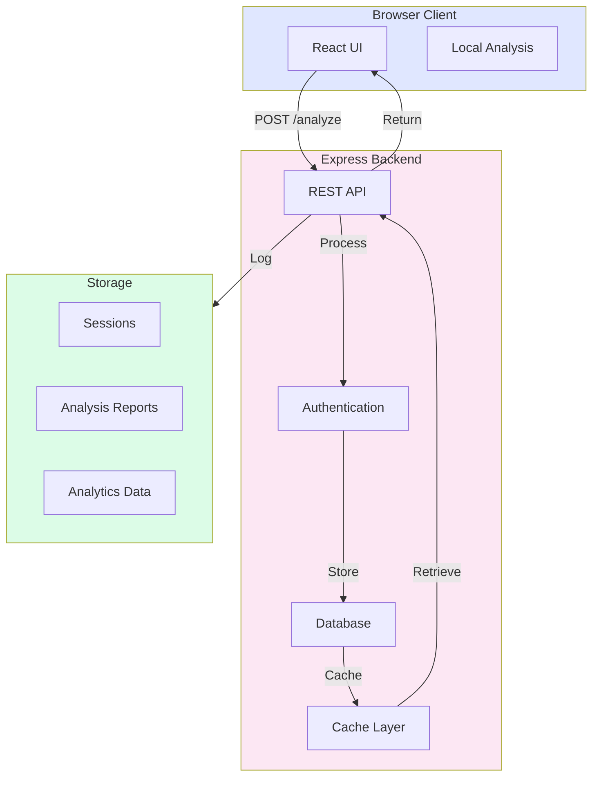

# Backend Flow

While MAYA's core analysis runs entirely in the browser, an optional Express.js backend enables features like result persistence, batch processing, and analytics. This document describes the server architecture.

## Optional Backend Architecture



## API Endpoints

### Core Endpoints

#### POST /api/analyze

Submit local analysis results for persistence.

**Request:**
```json
{
  "mediaId": "uuid-string",
  "mediaName": "suspicious-video.mp4",
  "mediaHash": "sha256-hash",
  "duration": 45.5,
  "analysisResults": {
    "metadata": {
      "score": 45,
      "findings": [...]
    },
    "faceMesh": {
      "score": 68,
      "anomalies": [...]
    },
    "audioSync": {
      "score": 89,
      "findings": [...]
    }
  },
  "compositeScore": 68,
  "timestamp": "2024-01-15T10:30:00Z"
}
```

**Response:**
```json
{
  "success": true,
  "reportId": "report-uuid",
  "reportUrl": "/api/reports/report-uuid",
  "message": "Analysis saved successfully"
}
```

#### GET /api/reports/:reportId

Retrieve a previously stored analysis report.

**Response:**
```json
{
  "reportId": "report-uuid",
  "mediaName": "suspicious-video.mp4",
  "analysisResults": {...},
  "compositeScore": 68,
  "createdAt": "2024-01-15T10:30:00Z",
  "expiresAt": "2024-02-14T10:30:00Z"
}
```

#### POST /api/batch-analyze

Submit multiple files for analysis queue.

**Request:**
```json
{
  "files": [
    { "id": "file1", "hash": "hash1" },
    { "id": "file2", "hash": "hash2" }
  ],
  "priority": "normal"
}
```

**Response:**
```json
{
  "batchId": "batch-uuid",
  "filesQueued": 2,
  "estimatedTime": 120,
  "statusUrl": "/api/batch/batch-uuid"
}
```

#### GET /api/batch/:batchId

Check batch processing status.

**Response:**
```json
{
  "batchId": "batch-uuid",
  "status": "processing",
  "progress": 50,
  "completed": 1,
  "total": 2,
  "results": [...]
}
```

## Express Server Implementation

### Basic Server Setup

```javascript
// server.js
import express from 'express';
import cors from 'cors';
import helmet from 'helmet';
import dotenv from 'dotenv';

dotenv.config();

const app = express();
const PORT = process.env.PORT || 3000;

// Middleware
app.use(helmet()); // Security headers
app.use(cors({
  origin: process.env.CORS_ORIGIN || 'http://localhost:5173',
  credentials: true
}));
app.use(express.json({ limit: '50mb' }));
app.use(express.urlencoded({ limit: '50mb', extended: true }));

// Health check
app.get('/health', (req, res) => {
  res.json({ status: 'healthy', timestamp: new Date() });
});

// Analysis endpoint
app.post('/api/analyze', async (req, res) => {
  try {
    const { mediaId, analysisResults, compositeScore } = req.body;
    
    // Validate input
    if (!mediaId || !analysisResults) {
      return res.status(400).json({ 
        error: 'Missing required fields' 
      });
    }
    
    // Store analysis
    const reportId = generateUUID();
    await storeAnalysisReport({
      reportId,
      mediaId,
      analysisResults,
      compositeScore,
      timestamp: new Date()
    });
    
    // Return result
    res.json({
      success: true,
      reportId,
      reportUrl: `/api/reports/${reportId}`
    });
    
  } catch (error) {
    console.error('Analysis error:', error);
    res.status(500).json({ 
      error: 'Analysis storage failed',
      message: error.message 
    });
  }
});

// Retrieve report
app.get('/api/reports/:reportId', async (req, res) => {
  try {
    const { reportId } = req.params;
    const report = await retrieveAnalysisReport(reportId);
    
    if (!report) {
      return res.status(404).json({ 
        error: 'Report not found' 
      });
    }
    
    res.json(report);
    
  } catch (error) {
    res.status(500).json({ error: error.message });
  }
});

// Start server
app.listen(PORT, () => {
  console.log(`MAYA Backend running on port ${PORT}`);
});
```

### Database Integration

```javascript
// models/analysisReport.js
import mongoose from 'mongoose';

const analysisSchema = new mongoose.Schema({
  reportId: { type: String, unique: true, required: true },
  mediaId: { type: String, required: true },
  mediaName: String,
  mediaHash: String,
  
  analysisResults: {
    metadata: {
      score: Number,
      findings: Array
    },
    faceMesh: {
      score: Number,
      anomalies: Array
    },
    audioSync: {
      score: Number,
      findings: Array
    }
  },
  
  compositeScore: Number,
  confidence: Number,
  
  createdAt: { type: Date, default: Date.now },
  expiresAt: { type: Date, default: () => new Date(+new Date() + 30*24*60*60*1000) },
  
  // Privacy
  ipAddress: { type: String, default: null }, // Can be disabled
  userAgent: { type: String, default: null },
  
  // Indexing
  tags: [String]
});

// Auto-expire documents
analysisSchema.index({ expiresAt: 1 }, { expireAfterSeconds: 0 });

export const AnalysisReport = mongoose.model('AnalysisReport', analysisSchema);
```

### Cache Layer

```javascript
// cache.js
import Redis from 'redis';

const redis = Redis.createClient({
  host: process.env.REDIS_HOST || 'localhost',
  port: process.env.REDIS_PORT || 6379
});

redis.on('error', (err) => console.log('Redis Client Error', err));

export async function cacheReport(reportId, data, ttl = 86400) {
  // Cache for 24 hours
  await redis.setEx(
    `report:${reportId}`,
    ttl,
    JSON.stringify(data)
  );
}

export async function getCachedReport(reportId) {
  const data = await redis.get(`report:${reportId}`);
  return data ? JSON.parse(data) : null;
}

export async function invalidateCache(reportId) {
  await redis.del(`report:${reportId}`);
}
```

### Batch Processing

```javascript
// batch.js
import Queue from 'bull';

const analysisQueue = new Queue('media-analysis', {
  redis: {
    host: process.env.REDIS_HOST || 'localhost',
    port: process.env.REDIS_PORT || 6379
  }
});

// Process batch jobs
analysisQueue.process(async (job) => {
  const { fileId, analysis } = job.data;
  
  try {
    // Perform any server-side processing
    const enrichedAnalysis = await enrichAnalysis(analysis);
    
    // Store results
    await storeAnalysisReport(enrichedAnalysis);
    
    // Update progress
    job.progress(100);
    
    return enrichedAnalysis;
    
  } catch (error) {
    throw new Error(`Batch processing failed: ${error.message}`);
  }
});

// Submit batch
app.post('/api/batch-analyze', async (req, res) => {
  const { files } = req.body;
  const batchId = generateUUID();
  
  // Add jobs to queue
  const jobs = await Promise.all(
    files.map(file => 
      analysisQueue.add(
        { fileId: file.id, hash: file.hash },
        { batchId, priority: 5, attempts: 3 }
      )
    )
  );
  
  res.json({
    batchId,
    filesQueued: jobs.length,
    statusUrl: `/api/batch/${batchId}`
  });
});

// Check batch status
app.get('/api/batch/:batchId', async (req, res) => {
  const { batchId } = req.params;
  const jobs = await analysisQueue.getJobs(['active', 'completed', 'failed']);
  
  const batchJobs = jobs.filter(j => j.data.batchId === batchId);
  
  res.json({
    batchId,
    status: batchJobs.some(j => j.progress < 100) ? 'processing' : 'completed',
    progress: calculateProgress(batchJobs),
    results: batchJobs.map(j => ({
      fileId: j.data.fileId,
      status: j.getState(),
      result: j.returnvalue
    }))
  });
});
```

## Analytics (Privacy-Respecting)

```javascript
// analytics.js
import Plausible from 'plausible-tracker';

const plausible = Plausible({
  domain: 'maya.example.com'
});

// Track aggregate statistics (no PII)
export function recordAnalysis(mediaType, compositeScore) {
  plausible.trackEvent('media_analyzed', {
    props: {
      mediaType,      // 'image' or 'video'
      scoreRange: Math.floor(compositeScore / 10) * 10 // 0-10, 10-20, etc
    }
  });
}

// Never track:
// - Actual media file names
// - User IP addresses
// - Media content
// - Individual reports
```

## Environment Variables

```bash
# Server Configuration
PORT=3000
NODE_ENV=development

# Database
MONGODB_URI=mongodb://localhost:27017/maya
MONGO_DB_NAME=maya_db

# Cache
REDIS_HOST=localhost
REDIS_PORT=6379
REDIS_PASSWORD=

# CORS
CORS_ORIGIN=http://localhost:5173

# File Storage
TEMP_DIR=./temp
MAX_FILE_SIZE=100mb

# Analytics
ANALYTICS_ENABLED=false
```

## Security Considerations

### Input Validation

```javascript
// Validate all incoming data
function validateAnalysisInput(data) {
  const schema = {
    mediaId: 'required|string',
    mediaHash: 'required|string|regex:/^[a-f0-9]{64}$/',
    compositeScore: 'required|number|min:0|max:100',
    analysisResults: 'required|object'
  };
  
  return validate(data, schema);
}
```

### Rate Limiting

```javascript
import rateLimit from 'express-rate-limit';

const limiter = rateLimit({
  windowMs: 15 * 60 * 1000, // 15 minutes
  max: 100, // limit each IP to 100 requests per windowMs
  message: 'Too many requests from this IP'
});

app.use('/api/', limiter);
```

### HTTPS/TLS

```javascript
// Force HTTPS in production
if (process.env.NODE_ENV === 'production') {
  app.use((req, res, next) => {
    if (req.header('x-forwarded-proto') !== 'https') {
      res.redirect(`https://${req.header('host')}${req.url}`);
    } else {
      next();
    }
  });
}
```

### Data Retention Policy

```javascript
// Auto-delete old reports
const cleanupOldReports = async () => {
  const thirtyDaysAgo = new Date(Date.now() - 30 * 24 * 60 * 60 * 1000);
  
  const result = await AnalysisReport.deleteMany({
    createdAt: { $lt: thirtyDaysAgo }
  });
  
  console.log(`Deleted ${result.deletedCount} old reports`);
};

// Run daily
schedule.scheduleJob('0 2 * * *', cleanupOldReports);
```

## Deployment Architecture

```
┌─────────────────────────────────────────────┐
│           Client (React)                    │
└────────────────┬────────────────────────────┘
                 │ HTTPS
┌────────────────▼────────────────────────────┐
│       Load Balancer (NGINX)                 │
└────────────────┬────────────────────────────┘
                 │
    ┌────────────┼────────────┐
    │            │            │
┌───▼──┐    ┌───▼──┐    ┌───▼──┐
│ Node │    │ Node │    │ Node │
│  1   │    │  2   │    │  3   │
└───┬──┘    └───┬──┘    └───┬──┘
    │           │           │
    └───────────┼───────────┘
                │
        ┌───────▼────────┐
        │   MongoDB      │
        │   (Replica)    │
        └────────────────┘
                │
        ┌───────▼────────┐
        │   Redis        │
        │   (Cache)      │
        └────────────────┘
```

## Monitoring & Logging

```javascript
// Structured logging
import winston from 'winston';

const logger = winston.createLogger({
  level: 'info',
  format: winston.format.json(),
  transports: [
    new winston.transports.File({ filename: 'error.log', level: 'error' }),
    new winston.transports.File({ filename: 'combined.log' })
  ]
});

app.post('/api/analyze', async (req, res) => {
  logger.info('Analysis started', {
    mediaId: req.body.mediaId,
    timestamp: new Date()
  });
  
  // ... processing ...
  
  logger.info('Analysis completed', {
    mediaId: req.body.mediaId,
    score: compositeScore,
    duration: elapsed
  });
});
```

## Next Steps

- 🧬 [Metadata Inspection](/features/metadata-inspection) - Layer 1 details
- 🎭 [Face Mesh Analysis](/features/face-mesh) - Layer 2 details
- 🎵 [Audio Synchronization](/features/audio-synchronization) - Layer 3 details
- 🚀 [Deployment Guide](/installation/deployment) - Production deployment

---

**The backend is optional but enables powerful features.** Continue to [Metadata Inspection](/features/metadata-inspection) to explore the forensic layers.