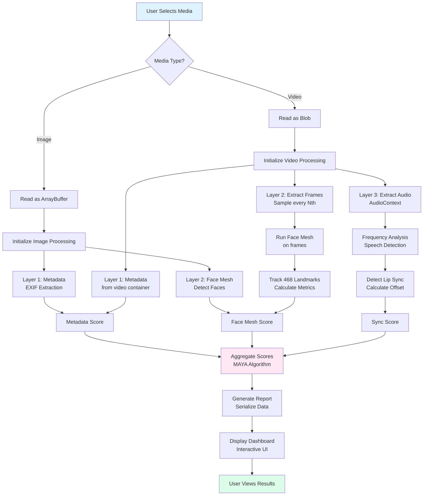

# Browser Flow

MAYA's core strength is its privacy-first architecture. All forensic analysis runs entirely within the user's browser with zero data transmission.

## Complete Browser Processing Pipeline



## Image Analysis Flow

### Step 1: Load Image

```javascript
// User selects image file
const file = input.files[0];
const arrayBuffer = await file.arrayBuffer();
const blob = new Blob([arrayBuffer], { type: file.type });
const img = new Image();
const url = URL.createObjectURL(blob);
img.onload = () => {
  // Image ready for processing
  startAnalysis(img, arrayBuffer);
};
img.src = url;
```

### Step 2: Metadata Extraction

```javascript
// Layer 1: Metadata Forensics
async function analyzeMetadata(arrayBuffer) {
  const exifData = EXIF.getAllTags(file);
  
  const analysis = {
    // EXIF fields
    camera: exifData.Model,
    iso: exifData.ISOSpeedRatings,
    software: exifData.Software,
    
    // File hash
    hash: await calculateSHA256(arrayBuffer),
    
    // Flags
    flags: []
  };
  
  // Check for suspicious software
  if (software.includes('Photoshop')) {
    analysis.flags.push({
      type: 'PHOTOSHOP_DETECTED',
      severity: 'MEDIUM'
    });
  }
  
  // Check for missing metadata
  if (!exifData.Model) {
    analysis.flags.push({
      type: 'MISSING_CAMERA_PROFILE',
      severity: 'LOW'
    });
  }
  
  return analysis;
}
```

### Step 3: Face Mesh Detection

```javascript
// Layer 2: Face Mesh Analysis (for images with faces)
async function analyzeFaceMesh(imageElement) {
  // Initialize MediaPipe
  const faceMesh = new FaceMesh({
    locateFile: (file) => 
      `https://cdn.jsdelivr.net/npm/@mediapipe/face_mesh/${file}`
  });
  
  // Detect faces
  const results = await faceMesh.send({ image: imageElement });
  
  if (!results.multiFaceLandmarks) {
    return { score: 100, reason: 'NO_FACES_DETECTED' };
  }
  
  const analysis = {
    facesDetected: results.multiFaceLandmarks.length,
    landmarks: results.multiFaceLandmarks,
    
    // Analyze geometry
    geometricAnomalies: [],
    score: 80
  };
  
  // Check each face
  for (const face of results.multiFaceLandmarks) {
    // Landmark indices for key features
    const leftEye = face[33];
    const rightEye = face[263];
    const nose = face[1];
    const mouth = face[13];
    
    // Calculate distances and angles
    const eyeDistance = calculateDistance(leftEye, rightEye);
    const eyeToNoseRatio = eyeDistance / calculateDistance(nose, mouth);
    
    // Check for unnatural geometry
    if (eyeToNoseRatio < 0.4 || eyeToNoseRatio > 0.8) {
      analysis.geometricAnomalies.push({
        type: 'UNNATURAL_FACE_GEOMETRY',
        severity: 'HIGH',
        ratio: eyeToNoseRatio
      });
    }
  }
  
  return analysis;
}
```

## Video Analysis Flow

### Step 1: Load Video

```javascript
// User selects video file
const file = input.files[0];
const videoElement = document.createElement('video');
videoElement.src = URL.createObjectURL(file);
videoElement.crossOrigin = 'anonymous';

videoElement.addEventListener('loadedmetadata', () => {
  const duration = videoElement.duration;
  const fps = 30; // target frame rate
  startVideoAnalysis(videoElement, duration, fps);
});
```

### Step 2: Frame Extraction

```javascript
// Extract frames at regular intervals
async function extractFrames(video, targetFps = 30) {
  const canvas = document.createElement('canvas');
  const ctx = canvas.getContext('2d');
  canvas.width = video.videoWidth;
  canvas.height = video.videoHeight;
  
  const frames = [];
  const sampleInterval = video.duration / (targetFps * video.duration);
  
  // Seek to different timestamps and extract frames
  for (let time = 0; time < video.duration; time += sampleInterval) {
    // Use a Promise to wait for frame to render
    await new Promise(resolve => {
      video.currentTime = time;
      video.addEventListener('seeked', () => {
        ctx.drawImage(video, 0, 0);
        const imageData = canvas.toDataURL('image/jpeg');
        frames.push({
          timestamp: time,
          data: imageData
        });
        resolve();
      }, { once: true });
    });
  }
  
  return frames;
}
```

### Step 3: Batch Face Mesh Processing

```javascript
// Process all frames in parallel
async function processFaceFrames(frames) {
  const faceMesh = new FaceMesh({...});
  
  const results = await Promise.all(
    frames.map(async (frame) => {
      const img = new Image();
      img.src = frame.data;
      
      // Get landmarks
      const detection = await faceMesh.send({ image: img });
      
      return {
        timestamp: frame.timestamp,
        landmarks: detection.multiFaceLandmarks,
        facesFound: detection.multiFaceLandmarks ? 
          detection.multiFaceLandmarks.length : 0
      };
    })
  );
  
  // Analyze temporal consistency
  return analyzeTemporalFaceData(results);
}

// Detect temporal anomalies
function analyzeTemporalFaceData(frameResults) {
  const analysis = {
    blinkRate: calculateBlinkRate(frameResults),
    faceWarpingFrames: [],
    inconsistencies: []
  };
  
  // Check for face warping between frames
  for (let i = 1; i < frameResults.length; i++) {
    const prev = frameResults[i-1];
    const curr = frameResults[i];
    
    if (!prev.landmarks || !curr.landmarks) continue;
    
    const displacement = calculateLandmarkDisplacement(
      prev.landmarks[0],
      curr.landmarks[0]
    );
    
    // Unnatural movement detected
    if (displacement > WARP_THRESHOLD) {
      analysis.faceWarpingFrames.push({
        frame: i,
        displacement,
        severity: 'MEDIUM'
      });
    }
  }
  
  return analysis;
}

// Calculate blink rate
function calculateBlinkRate(frameResults) {
  let blinks = 0;
  const EYE_ASPECT_RATIO_THRESHOLD = 0.2;
  
  for (const result of frameResults) {
    if (!result.landmarks) continue;
    
    const landmarks = result.landmarks[0];
    
    // Eye landmarks: 33, 246 (left), 263, 466 (right)
    const leftEyeRatio = calculateEyeAspectRatio(
      landmarks[33], landmarks[246]
    );
    const rightEyeRatio = calculateEyeAspectRatio(
      landmarks[263], landmarks[466]
    );
    
    if (leftEyeRatio < EYE_ASPECT_RATIO_THRESHOLD &&
        rightEyeRatio < EYE_ASPECT_RATIO_THRESHOLD) {
      blinks++;
    }
  }
  
  const blinksPerMinute = (blinks / frameResults.length) * 60 * fps;
  return {
    count: blinks,
    perMinute: blinksPerMinute,
    normal: blinksPerMinute >= 12 && blinksPerMinute <= 21
  };
}
```

### Step 4: Audio Analysis

```javascript
// Extract audio and analyze synchronization
async function analyzeAudioSync(videoFile) {
  const audioContext = new AudioContext();
  const arrayBuffer = await videoFile.arrayBuffer();
  
  // Decode audio
  const audioBuffer = await audioContext.decodeAudioData(arrayBuffer);
  const audioData = audioBuffer.getChannelData(0);
  
  // Analyze frequency spectrum
  const analyser = audioContext.createAnalyser();
  analyser.fftSize = 2048;
  const dataArray = new Uint8Array(analyser.frequencyBinCount);
  analyser.getByteFrequencyData(dataArray);
  
  // Detect speech regions (higher energy around 500-3000 Hz)
  const speechFrames = detectSpeech(dataArray);
  
  // Compare with lip movement
  return {
    speechFrames,
    syncOffset: calculateLipSyncOffset(speechFrames),
    anomalies: detectSyncAnomalies(speechFrames)
  };
}

function calculateLipSyncOffset(speechFrames, lipFrames) {
  // For each speech frame, find closest lip movement
  const offsets = [];
  
  for (const speechFrame of speechFrames) {
    const closestLip = lipFrames.reduce((closest, lip) => {
      const dist = Math.abs(speechFrame - lip);
      return dist < Math.abs(closest - speechFrame) ? lip : closest;
    });
    
    offsets.push(Math.abs(speechFrame - closestLip));
  }
  
  // Normal sync: < 80ms
  const avgOffset = offsets.reduce((a, b) => a + b) / offsets.length;
  
  return {
    averageMs: avgOffset,
    isAnomalous: avgOffset > 80,
    severity: avgOffset > 150 ? 'HIGH' : 'MEDIUM'
  };
}
```

## Score Aggregation

```javascript
// Combine all three layer scores
function calculateCompositeScore(layer1, layer2, layer3) {
  // Weighted average
  const weights = {
    metadata: 0.3,
    faceMesh: 0.35,
    audioSync: 0.35
  };
  
  const composite = 
    (layer1.score * weights.metadata) +
    (layer2.score * weights.faceMesh) +
    (layer3.score * weights.audioSync);
  
  // Adjust for severity of anomalies
  let adjustedScore = composite;
  
  for (const anomaly of getAllAnomalies([layer1, layer2, layer3])) {
    switch (anomaly.severity) {
      case 'HIGH':
        adjustedScore -= 25;
        break;
      case 'MEDIUM':
        adjustedScore -= 10;
        break;
      case 'LOW':
        adjustedScore -= 3;
        break;
    }
  }
  
  // Clamp to 0-100
  return Math.max(0, Math.min(100, adjustedScore));
}
```

## Memory Management

```javascript
// Clean up after analysis
function cleanupMemory() {
  // Revoke blob URLs
  URL.revokeObjectURL(videoUrl);
  URL.revokeObjectURL(imageUrl);
  
  // Clear canvas
  canvas.width = 0;
  canvas.height = 0;
  
  // Stop audio context
  if (audioContext.state !== 'closed') {
    audioContext.close();
  }
  
  // Garbage collection
  frames = null;
  videoElement = null;
  
  // Notify browser to collect
  if (window.gc) window.gc();
}
```

## Performance Optimization

### Parallel Processing

```javascript
// Run all three layers simultaneously
const results = await Promise.all([
  analyzeMetadata(file),
  analyzeFaceGeometry(file),
  analyzeAudioSync(file)
]);
```

### Progressive Feedback

```javascript
// Show progress to user as layers complete
layer1Complete$ = subject();
layer2Complete$ = subject();
layer3Complete$ = subject();

Promise.all([...]).then(results => {
  updateUI({ progress: 33, layer: 'Metadata' });
  updateUI({ progress: 66, layer: 'Face Analysis' });
  updateUI({ progress: 100, layer: 'Audio Sync' });
  displayFinalReport(results);
});
```

## Error Handling

```javascript
// Graceful error handling
async function analyzeMediaSafely(file) {
  try {
    const results = await Promise.allSettled([
      analyzeMetadata(file),
      analyzeFaceGeometry(file),
      analyzeAudioSync(file)
    ]);
    
    return results.map((r, i) => 
      r.status === 'fulfilled' ? r.value : getDefaultScore(i)
    );
    
  } catch (error) {
    console.error('Analysis failed:', error);
    return {
      success: false,
      message: 'Analysis encountered an error',
      error: error.message
    };
  }
}
```

## Next Steps

- 🖥️ [Backend Flow](/architecture/backend-flow) - Optional server-side processing
- 🧬 [Metadata Inspection](/features/metadata-inspection) - Detailed Layer 1 analysis
- 🎭 [Face Mesh Analysis](/features/face-mesh) - Detailed Layer 2 analysis
- 🎵 [Audio Synchronization](/features/audio-synchronization) - Detailed Layer 3 analysis

---

**All analysis happens locally in your browser.** Continue to [Backend Flow](/architecture/backend-flow) to understand optional server integration.