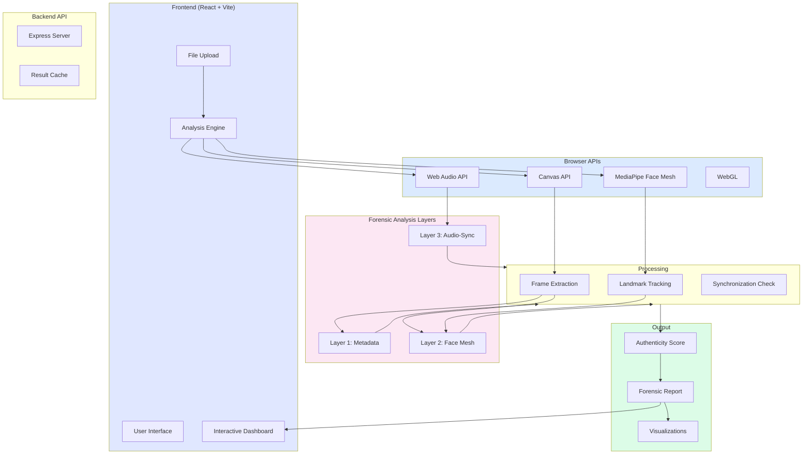
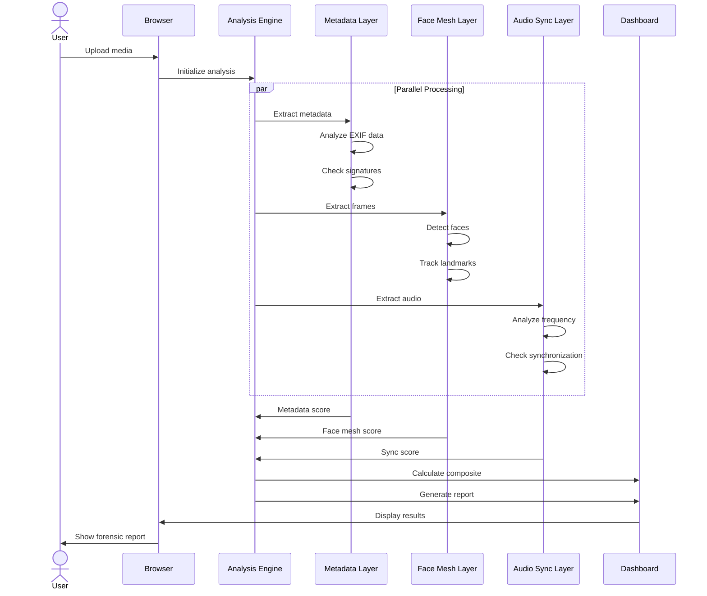

# System Overview

MAYA is a multi-layered digital media authentication system built on a privacy-first architecture. This document provides a comprehensive overview of how all components interact.

## High-Level Architecture



## Core Components

### 1. Frontend (React + Vite)

The user-facing application built with modern React patterns.

**Key Features:**
- Responsive UI optimized for desktop and tablet
- Real-time processing feedback
- Interactive forensic visualizations
- Zero external API calls (privacy-first)

**Components:**
- File upload interface
- Media preview player
- Real-time analysis status
- Interactive dashboard
- Timeline visualization

### 2. Forensic Analysis Engine

Three-layer detection system running entirely in the browser.

#### Layer 1: Metadata Forensics
- EXIF data extraction using `exif-js`
- Software signature detection
- File integrity validation using SHA-256
- Camera profile analysis

#### Layer 2: Face Mesh Analysis
- 468-point facial landmark detection using MediaPipe
- Blink rate calculation
- Face geometry consistency checking
- Temporal anomaly detection

#### Layer 3: Audio-Visual Synchronization
- Audio frequency analysis using Web Audio API
- Lip movement tracking
- Synchronization offset calculation
- Timing anomaly detection

### 3. Dashboard & Reporting

Interactive visualization of forensic findings.

**Displays:**
- Overall authenticity score (0-100%)
- Layer-by-layer breakdown
- Frame-by-frame timeline
- Warning cards with explanations
- Detailed forensic report

### 4. Backend API (Optional)

Express.js server for caching and result management.

**Responsibilities:**
- Result storage and retrieval
- Batch processing coordination
- Analytics (privacy-respecting)
- Report generation

## Data Flow Architecture

### Complete Analysis Pipeline



## Layer Details

### Layer 1: Metadata Forensics

**Input:** File headers and EXIF data

**Processing:**
```
1. Extract EXIF metadata
2. Parse software signatures
3. Check camera profile validity
4. Validate timestamp consistency
5. Detect suspicious indicators
```

**Output:**
```json
{
  "score": 45,
  "findings": [
    {
      "flag": "GENERATIVE_FILL_DETECTED",
      "severity": "HIGH",
      "description": "Adobe Photoshop Generative Fill signature found"
    }
  ]
}
```

### Layer 2: Face Mesh Analysis

**Input:** Video frames

**Processing:**
```
1. Detect faces in frames
2. Extract 468 facial landmarks
3. Calculate blink rate
4. Measure mouth geometry
5. Detect face warping or artifacts
6. Track temporal inconsistencies
```

**Output:**
```json
{
  "score": 68,
  "landmarks_detected": 468,
  "anomalies": [
    {
      "type": "FACE_WARPING",
      "frame": 127,
      "severity": "MEDIUM",
      "confidence": 0.82
    }
  ]
}
```

### Layer 3: Audio-Visual Synchronization

**Input:** Audio stream and facial movements

**Processing:**
```
1. Extract audio frequency spectrum
2. Detect speech patterns
3. Measure lip distance variations
4. Calculate sync offset
5. Detect timing anomalies
```

**Output:**
```json
{
  "score": 89,
  "sync_offset_ms": 45,
  "anomalies": []
}
```

## Browser APIs Used

| API | Purpose | Why |
|-----|---------|-----|
| **Canvas** | Frame extraction from video | Fast, native video processing |
| **Web Audio** | Audio frequency analysis | Real-time audio processing |
| **MediaPipe** | Face mesh detection | Accurate, fast ML-based detection |
| **WebGL** | GPU acceleration | Real-time processing performance |
| **localStorage** | Cache analysis results | Fast retrieval without re-analysis |
| **Blob/FormData** | File handling | Efficient media processing |

## Performance Architecture

### Optimization Strategies

1. **Parallel Processing**
   - All three layers run simultaneously
   - Reduces analysis time from O(3n) to O(n)

2. **GPU Acceleration**
   - WebGL for heavy computations
   - MediaPipe runs on GPU when available

3. **Frame Sampling**
   - Videos: analyze every Nth frame
   - Balances accuracy vs. performance

4. **Progressive Loading**
   - Show results as layers complete
   - Don't block UI on analysis

### Typical Performance

| Media Type | Processing Time | Components |
|------------|-----------------|------------|
| **Photo** | 1-3 seconds | Metadata + Face Mesh |
| **Video** | 5-15 seconds | All layers, frame sampling |
| **Large Video** | 15-30 seconds | Aggressive frame sampling |

## Privacy Architecture

### No Cloud Upload

```
Traditional:
Media → Upload → Cloud Server → Analyze → Result
                    ↓
            (Privacy Risk)

MAYA:
Media → Browser → Analyze → Result (stays local)
        ↓
     (Private)
```

### Local Processing Only

- All analysis happens on user's device
- No media transmission
- No server-side storage
- No training data collection

### Data Isolation

```javascript
// All processing in browser context
const mediaData = await file.arrayBuffer();
// Process locally - never sent anywhere
const analysis = await analyzeLocally(mediaData);
// Display results
displayReport(analysis);
// mediaData is garbage collected after analysis
```

## Scalability Design

### Browser-Based Scaling

Since processing happens client-side:

- **No server bottleneck** - Each client is independent
- **Horizontal scaling** - Thousands of concurrent users
- **Offline capable** - Works without internet
- **Low cost** - Minimal backend requirements

### Backend (Optional)

If a backend is deployed:

- Stores analysis history
- Manages user profiles
- Provides analytics
- Handles batch operations

## Security Considerations

### Input Validation

- File type verification
- File size limits
- Format validation
- Memory usage monitoring

### Processing Safety

- Sandboxed browser execution
- No JavaScript injection
- Memory limits enforced
- Timeout protection

### Output Protection

- No sensitive data in reports
- Local storage encryption
- CORS headers properly set
- No tracking pixels

## Extension Points

MAYA is designed for extension:

1. **New Forensic Layers** - Add additional detection methods
2. **Custom Algorithms** - Implement proprietary detection
3. **Backend Integration** - Connect to existing systems
4. **UI Customization** - Theme and rebrand
5. **Mobile Support** - React Native adaptation

## Next Steps

- 🔍 [Explore Browser Flow](/architecture/browser-flow) - Detailed client-side processing
- 🖥️ [Explore Backend Flow](/architecture/backend-flow) - Server-side architecture (if deployed)
- 🧬 [Metadata Inspection](/features/metadata-inspection) - Deep dive into Layer 1
- 🎭 [Face Mesh Analysis](/features/face-mesh) - Deep dive into Layer 2
- 🎵 [Audio Synchronization](/features/audio-synchronization) - Deep dive into Layer 3

---

**Understanding the complete system flow is key to MAYA's power.** Continue to [Browser Flow](/architecture/browser-flow).