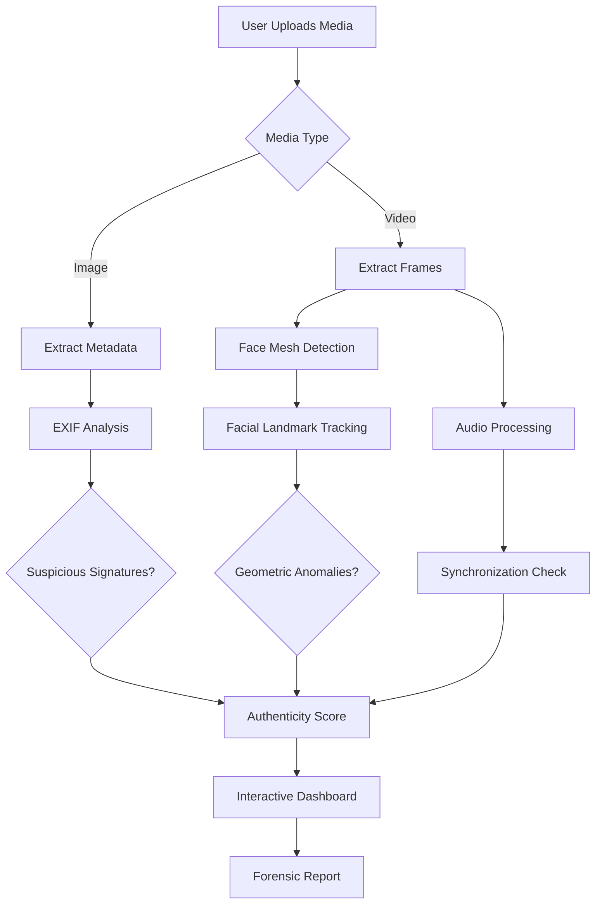

# Introduction

Welcome to **MAYA** (Multi-Modal Digital Media Authenticity Verification Engine), an explainable digital media authenticity verification platform that runs entirely in your browser.

## What Problem Does MAYA Solve?

The digital media landscape faces an unprecedented threat: deepfakes and sophisticated media manipulation techniques are becoming increasingly difficult to distinguish from authentic content.

### The Challenge

- **Rapid advancement** - Generative AI models improve monthly
- **Accessibility** - Deepfake tools are now available to anyone
- **Scale** - Millions of manipulated videos shared daily
- **Impact** - Misinformation spreads faster than corrections

Traditional deepfake detection systems fall short:

| Problem | Traditional Detection | MAYA |
|---------|----------------------|------|
| **Transparency** | Black box (Real/Fake) | Explains forensic findings |
| **Privacy** | Cloud uploading required | Browser-only processing |
| **Speed** | Network latency | Instant, local analysis |
| **Access** | Requires API keys/subscriptions | Open source, self-hosted |
| **Accuracy** | Single classifier | Three independent analyses |

### The MAYA Solution

MAYA implements **explainable AI forensics** with three independent verification layers:

```
┌─────────────────────────────────────────────────────────┐
│                    Media Analysis                        │
├─────────────────────────────────────────────────────────┤
│                                                         │
│  Layer 1: Metadata Forensics                            │
│  └─ Extracts EXIF, software signatures, anomalies       │
│                                                         │
│  Layer 2: Face Mesh Geometry                            │
│  └─ Tracks 468 facial landmarks for inconsistencies     │
│                                                         │
│  Layer 3: Audio-Visual Sync                             │
│  └─ Compares lip movement with audio timing             │
│                                                         │
├─────────────────────────────────────────────────────────┤
│         Authenticity Score + Detailed Report             │
│            (Why the media is suspicious)                │
└─────────────────────────────────────────────────────────┘
```

## Key Features

### 🔒 Privacy-First Architecture

- **No uploading** - Media never leaves your browser
- **No storage** - Analysis results aren't persisted
- **No tracking** - Your interactions are private
- **No phone home** - Completely offline capable

```javascript
// Media stays on your device
User Device {
  Browser {
    Metadata → Analysis
    Video → Face Mesh → Analysis
    Audio → Sync Analysis
    ↓
    Authenticity Report (displayed locally)
  }
}
```

### 🧠 Explainable Results

Rather than a simple "Real/Fake" output, MAYA provides:

- **Authenticity Score** (0-100%) with confidence levels
- **Metadata Flags** (missing camera profile, suspicious software)
- **Face Mesh Anomalies** (unnatural warping, blinking patterns)
- **Sync Issues** (lip-audio desynchronization)
- **Timestamp Timeline** (frame-by-frame analysis)
- **Detailed Reasoning** (why each flag was triggered)

### ⚡ Three-Layer Detection

| Layer | Technology | Detects |
|-------|-----------|---------|
| **Metadata** | EXIFReader, SHA-256 | Generative fills, AI software signatures, missing camera profiles |
| **Face Mesh** | MediaPipe (468 landmarks) | Face warping, unnatural blinking, geometric inconsistencies |
| **Audio-Sync** | Web Audio API | Lip-sync issues, timing mismatches, temporal anomalies |

## Architecture Overview

### Browser-Based Processing

```
Input Media
    ↓
[Canvas API] → Extract frames
    ↓
[MediaPipe] → Face mesh extraction
    ↓
[Web Audio API] → Audio frequency analysis
    ↓
[WebGL] → GPU-accelerated processing
    ↓
Forensic Report
    ↓
Interactive Dashboard
```

### Why Browser-Based?

| Benefit | Impact |
|---------|--------|
| **Instant** | No network round-trip needed |
| **Private** | No server-side processing |
| **Scalable** | Client-side computation |
| **Accessible** | Works offline, no API keys |
| **Compliant** | GDPR/CCPA friendly |

## Technology Highlights

### Frontend
- **React** - Component-based UI
- **Vite** - Lightning-fast development
- **TailwindCSS** - Modern styling
- **Lucide Icons** - Beautiful iconography

### Processing
- **MediaPipe Face Mesh** - 468-point facial landmark detection
- **Web Audio API** - Real-time audio analysis
- **Canvas API** - Frame extraction
- **WebGL** - GPU acceleration

### Forensics
- **EXIFReader** - Metadata extraction
- **SHA-256** - File integrity verification
- **Custom algorithms** - Sync detection & anomaly scoring

## Use Cases

### Content Verification
Journalists and researchers can verify media authenticity before publication.

### Social Media Moderation
Platforms can detect likely manipulated content with explainable reasoning.

### Legal Evidence
Provide detailed forensic reports as supporting evidence.

### Media Literacy
Educate users about how media can be manipulated and detected.

### Academic Research
Study manipulation patterns with detailed forensic data.

## Next Steps

::: info Ready to start?
1. **[Explore the problem statement](/guide/problem-statement)** to understand deepfake threats
2. **[Try the quick start](/guide/quick-start)** to get MAYA running
3. **[Study the architecture](/architecture/overview)** to understand how it works
4. **[Learn about features](/features/metadata-inspection)** to see detection capabilities
:::

## Architecture Diagram



---

**Ready to dive deeper?** Continue to [Problem Statement](/guide/problem-statement).